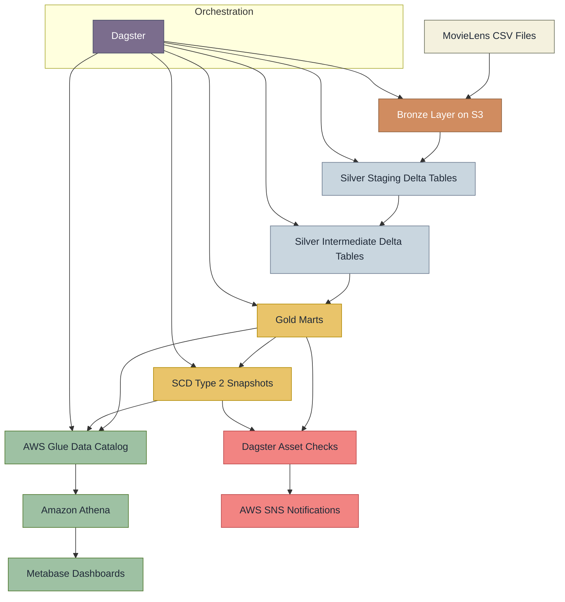
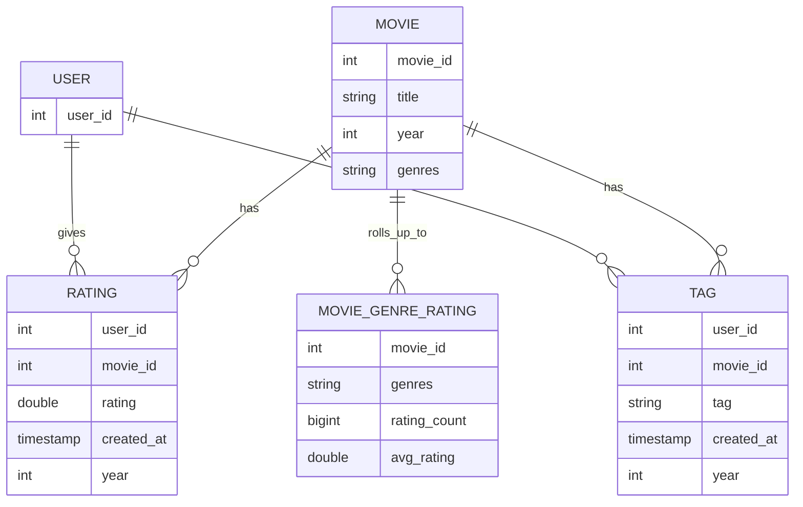

# MovieLens Lakehouse Pipeline

[](#tech-stack)
[](#tech-stack)
[](#tech-stack)
[](#tech-stack)
[](#tech-stack)

An end-to-end ELT lakehouse project built on the MovieLens 32M dataset with Dagster, PySpark, Delta Lake, S3, AWS Glue, Athena, SNS, and Metabase.

This project takes raw CSV files, lands them in a Bronze layer on S3, transforms them into clean Silver dimension and fact tables, builds Gold analytical marts and SCD Type 2 snapshots, registers them in Glue, exposes them through Athena, and visualizes the results in Metabase.

## Project At A Glance

- Built a medallion-style lakehouse pipeline from raw CSV to analytics-ready marts
- Used Dagster asset-based orchestration for lineage, checks, scheduling, and observability
- Implemented incremental Delta MERGE for partitioned rating ingestion
- Registered Gold Delta tables in Glue and queried them through Athena
- Added SNS alerts for pipeline success and failure events
- Delivered dashboard-ready analytics in Metabase

## Showcase Highlights

- Asset-based orchestration with Dagster instead of ad hoc scripts
- Medallion architecture on S3 with Delta Lake tables
- Incremental processing for `fact_ratings` using yearly partitions and Delta MERGE
- Data quality checks on Silver and Gold assets
- Historical tracking with SCD Type 2 snapshots
- AWS-native serving layer with Glue Catalog, Athena, and SNS
- BI-ready analytics exposed through Metabase dashboards

## What This Repo Demonstrates

- How to design an ELT pipeline on a lakehouse instead of a traditional warehouse-only stack
- How to move from raw ingestion to curated marts with clear Bronze, Silver, and Gold boundaries
- How to combine orchestration, storage, metadata, serving, alerting, and BI in one project
- How to make a portfolio project feel closer to a production-style data platform

## Architecture



### Pipeline Architecture Image

Add your main pipeline image here.

```md

```

### Dagster Asset Graph Image

Add your Dagster asset graph screenshot here.

```md

```

### Dashboard Image

Add your Metabase dashboard screenshot here.

```md

```

## Tech Stack

| Area | Tools |
|------|-------|
| Orchestration | Dagster |
| Processing | PySpark 3.5, Delta Lake |
| Storage | AWS S3 |
| Metadata Catalog | AWS Glue |
| Query Engine | Amazon Athena |
| Notifications | AWS SNS |
| BI / Dashboard | Metabase |
| Runtime | Docker Compose, Python 3.11 |
| Metadata DB | PostgreSQL |

## ELT Flow

This project follows an ELT pattern.

1. Extract raw MovieLens CSV files from the local `data/` folder.
2. Load them as-is into the Bronze layer on S3.
3. Transform data inside the lakehouse into Silver and Gold Delta tables.
4. Serve the final analytical layer through Glue, Athena, and Metabase.

## Medallion Layers

### Bronze

Raw CSV files copied to S3 with no business transformations.

- `bronze_movies`
- `bronze_links`
- `bronze_ratings`
- `bronze_tags`

### Silver

Structured, validated Delta tables used as the analytical backbone.

#### Staging

- `stg_movies`
- `stg_links`
- `stg_ratings`
- `stg_tags`

#### Intermediate

- `dim_movies`
- `dim_users`
- `fact_ratings`
- `fact_tags`
- `fact_movie_genre_ratings`

### Gold

Business-ready marts and historical snapshots.

#### Marts

- `mart_movie_analytics`
- `mart_user_behavior`
- `mart_genre_performance`

#### Snapshots

- `snap_mart_movie_analytics`
- `snap_mart_user_behavior`
- `snap_mart_genre_performance`

## Data Model

The Silver layer uses a star-schema-style model with dimensions and facts, while the Gold layer exposes denormalized marts for BI and consumption.

### Entity Relationship Diagram



## Key Business Outputs

### `mart_movie_analytics`

Used to answer questions like:

- Which movies have the most ratings?
- Which movies are highly rated but under-engaged?
- Which titles generate the most tagging activity?

Core metrics:

- total ratings
- average rating
- rating spread and rating span
- engagement tier
- quality tier
- combined genres

### `mart_user_behavior`

Used to analyze:

- user engagement segments
- rating behavior patterns
- favorite genres by user
- average activity per day

### `mart_genre_performance`

Used to analyze:

- which genres are most popular
- which genres are highest rated
- decade distribution by genre
- genre-level tag activity and audience size

## Data Quality

Dagster asset checks are included for Silver and Gold tables.

Examples:

- uniqueness checks on business keys
- referential integrity checks between facts and dimensions
- row-count consistency checks
- genre set consistency checks
- exploded rating preservation checks

## Incremental Processing

`fact_ratings` is partitioned yearly and uses Delta MERGE.

This means the pipeline can:

- process one year at a time
- backfill partitions selectively
- avoid full refresh on the largest fact table

## AWS Integrations

### Glue Catalog

Gold marts and snapshots are registered in AWS Glue so they can be queried through Athena.

### Athena

Athena is used as the serverless SQL layer on top of Delta tables stored in S3.

### SNS

SNS notifications are triggered through Dagster hooks for run success and failure events.

## Metabase Dashboard

Metabase is connected to Athena to explore and present Gold data.

Example dashboard ideas:

- Top 20 movies by total ratings
- Movie quality tier distribution
- User segment distribution
- Genre popularity vs average rating
- Preferred genre distribution by user

## Project Structure

```text
movie_analysis/
├── configs/
├── data/
├── movie_pipeline/
│   ├── assets/
│   ├── checks/
│   ├── hooks/
│   ├── resources/
│   ├── utils/
│   ├── definitions.py
│   └── partitions.py
├── tests/
├── docker-compose.yml
├── Makefile
├── pyproject.toml
└── Readme.MD
```

## Local Setup

### 1. Create environment file

Create `.env` with values like:

```dotenv
AWS_ACCESS_KEY_ID=your_key
AWS_SECRET_ACCESS_KEY=your_secret
AWS_REGION=ap-southeast-1
S3_BUCKET=your_bucket

GLUE_DATABASE=movielens
SNS_TOPIC_ARN=your_topic_arn
SNS_REGION=us-east-1

SPARK_MASTER=local[*]
SPARK_DRIVER_MEMORY=4g
SPARK_EXECUTOR_MEMORY=4g

DAGSTER_HOME=/opt/dagster/dagster_home
POSTGRES_USER=postgres
POSTGRES_PASSWORD=postgres
POSTGRES_DB=dagster
```

### 2. Start the stack

```bash
make up-d
```

This starts:

- PostgreSQL
- Dagster webserver
- Dagster daemon
- Metabase

### 3. Open services

- Dagster UI: `http://localhost:3000`
- Spark UI: `http://localhost:4040`
- Metabase: `http://localhost:3001`

## Useful Commands

```bash
make up-d
make restart
make ps
make logs
make logs-daemon
make logs-metabase
make down
```

## Typical Run Order

1. Materialize Bronze assets
2. Materialize Silver staging assets
3. Materialize Silver intermediate assets
4. Materialize Gold marts
5. Materialize Gold snapshots
6. Materialize `register_gold_glue_catalog`
7. Query Gold tables in Athena
8. Build dashboards in Metabase

## What I Built In This Project

- a production-style medallion pipeline instead of a notebook-only workflow
- partitioned incremental processing with Delta Lake
- asset checks and operational notifications
- AWS-integrated serving layer for analytics
- a complete path from raw data to dashboard

## Future Improvements

- add automated tests for transformations and checks
- add CI for linting and validation
- add cost and performance monitoring for Athena queries
- publish dashboard screenshots and pipeline diagrams
- add data contracts or schema drift monitoring

## Notes

This project is designed as a portfolio-grade data engineering pipeline. It demonstrates orchestration, data modeling, storage layout, incremental processing, catalog registration, query serving, observability, and downstream analytics in one repo.
